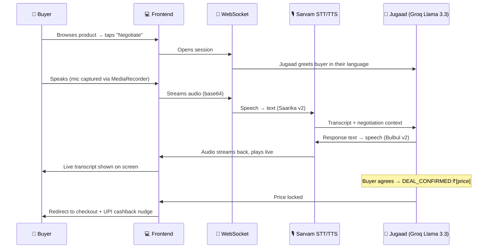

<div align="center">

# Jugaad: AI-powered negotiation pipeline built for Indian E-commerce

[](#)
[](#)
[](#)

[](#)
[](#)
[](#)
[](#)
[](#)

</div>

---

## What is Jugaad?

> *Jugaad (n.) — the Indian art of the clever, frugal fix. A workaround that just... works.*

Bargaining is in India's DNA.
E-commerce killed that ritual. Fixed MRP. Take it or leave it.

Instead of one "Buy Now" button, buyers get two:

| 🛒 Buy Now | 🗣️ Negotiate |
|---|---|
| Pay listed price instantly | Open a live voice call with **Jugaad**, your AI shopkeeper |

Jugaad bargains like a real seller, anchors high, concedes slowly, never breaks the vendor's floor price, entirely in the buyer's own language.

---

## The Problem

<table>
<tr><td>

**140M+** Indian e-commerce buyers, mostly from Tier 2/3 and rural markets, where negotiation isn't optional, it's social currency. E-commerce gives them none of it.

</td></tr>
</table>

| Metric | Reality |
|---|---|
| COD order share on Meesho | **~67%** |
| Return rate on COD orders | **40–50%** |
| #1 cited return reason | *"Price felt too high"* |
| Cart abandonment (first visit) | **~72%** |
| Platforms offering negotiation | **0** |

Buyers *wait for sales*. Inventory sits idle for weeks while vendors hope a discount event will move it, eroding margin and training buyers to never pay full price. **Negotiation collapses that wait into a single conversation, today.**

### Why hasn't anyone solved this?

1. **Language barrier** — most AI shopping bots are English-only; Meesho's core users aren't.
2. **No voice interface** — negotiation is spoken and emotional, not a text chatbox.
3. **Static pricing** — no infrastructure exists for safe, per-buyer dynamic pricing.

---

## The Solution

Jugaad opens a **real-time voice WebSocket session** between the buyer and Priya, an AI sales agent with a goal, a personality, and a hard financial guardrail.

```
Buyer speaks Hindi, Tamil, Kannada, Bengali... (10+ languages)
Jugaad negotiates: anchors at MRP, concedes strategically
Never drops below the vendor's floor price (hard backend constraint)
Deal closes → buyer redirected to checkout at the negotiated price
UPI nudge fires at close, attacking Meesho's COD problem directly
```

### Language-first, not language-patched

Most voice AI is Hindi-or-English-only. Jugaad's language layer is **infrastructure**, powered end-to-end by **Sarvam AI's** multilingual stack (STT → LLM → TTS) in the buyer's chosen language. 
---

## 🎬 How It Works



---

## 🏗️ Architecture

```
┌──────────────────────────────────────────────────────────────┐
│                  FRONTEND · Next.js 15 (App Router)           │
│                                                                │
│   /home            Product discovery, categories, banner      │
│   /product/[id]    Product detail · Buy Now / Negotiate       │
│   /negotiate/[s]   Live voice negotiation UI (websocket)                 │
│   /checkout        Deal confirmation                          │
│                                                                │
│   JugaadWordmark · BottomNav · ProductCard · ProductCarousel  │
│   HomeBanner · AIOrb · LiveTranscript · NegotiateHeader        │
└──────────────────────────┬─────────────────────────────────────┘
                            │  WebSocket (ws://)  +  REST
┌──────────────────────────▼─────────────────────────────────────┐
│                 BACKEND · FastAPI + Python 3.11                │
│                                                                │
│   /buyer/products          Product catalog                    │
│   /buyer/negotiate/start   Create WS session                  │
│   /ws/negotiate/[id]       Live WebSocket handler              │
│   /buyer/checkout          Finalize deal                      │
│   /vendor/[id]/dashboard   Vendor analytics                   │
│                                                                │
│   🤖 Agents                        🎙️ Voice                   │
│   ├─ NegotiationAgent (Groq)       ├─ STT · Sarvam Saarika v2  │
│   ├─ PriceIntelligence             └─ TTS · Sarvam Bulbul v2   │
│   └─ DealClosingAgent                                          │
└──────────────────────────────────────────────────────────────┘
```

---

## 🧰 Tech Stack

<table>
<tr>
<td valign="top" width="33%">

**Frontend**

| Tech | Purpose |
|---|---|
| Next.js 15 | App Router, routing |
| Tailwind v4 | Styling |
| Framer Motion | Animations |
| Lucide React | Icons |
| MediaRecorder API | Mic capture |
| WebSocket API | Realtime stream |

</td>
<td valign="top" width="33%">

**Backend**

| Tech | Purpose |
|---|---|
| FastAPI | REST + WS server |
| Python 3.11+ | Runtime |
| SQLite + SQLAlchemy | DB |
| Groq SDK | LLM inference |
| httpx | Async Sarvam calls |
| python-dotenv | Env config |

</td>
<td valign="top" width="33%">

**AI / Voice**

| Service | Model |
|---|---|
| Groq | Llama 3.3 70B |
| Sarvam AI | Saarika v2 (STT) |
| Sarvam AI | Bulbul v2 "Manisha" (TTS) |

</td>
</tr>
</table>

### Why these, specifically

- ⚡ **Groq over OpenAI/Anthropic** because we get sub-200ms token generation on Groq's LPU hardware. A 3-second "thinking" pause kills the live-negotiation feel.
- 🇮🇳 **Sarvam over ElevenLabs/Google TTS** because that is built natively for Indian phonetics and Devanagari cadence, not bolted on after English.
- 🔌 **WebSocket over REST polling** — negotiation is bidirectional and live; REST would tax every exchange with 400–800ms of dead air.


## 🛡️ Price Intelligence & the Floor Price Guarantee

Every product carries two numbers the buyer never sees:

| Price | Meaning |
|---|---|
| **Floor price** | Minimum the vendor will accept (set in vendor dashboard) |
| **Target price** | Ideal close, computed as MRP × margin factor |

The floor price is enforced **server-side, as a hard constraint** — not a suggestion fed to the AI. No matter how aggressively a buyer pushes, Priya physically cannot close below it.

That single guarantee is the whole trust mechanism for seller adoption:

- ✅ Vendors are never surprised by a loss-making deal
- ✅ Priya's concessions are strategic, never arbitrary
- ✅ Tighter floors on fresh stock, looser floors to clear aging inventory


---

## Why This Wins for Meesho

1. **Zero behaviour change** — buyers already negotiate in real life; Jugaad just digitizes it.
2. **Every Indian language, not just Hindi** — onboarding-time language selection, enforced end-to-end through STT → LLM → TTS.
3. **Seller-safe by design** — the floor price is code, not a guideline, so vendors actually opt in.
4. **Kills the sale-waiting cycle** — buyers stop holding out for discount events; purchases move forward by weeks.
5. **UPI nudge built-in** — every closed deal pushes prepaid, attacking the COD crisis at peak buyer intent.
6. **Pluggable** — a WebSocket microservice that drops alongside the existing catalog with minimal integration.

---

## What's Built vs What's in the pipeline

<table>
<tr>
<td valign="top" width="50%">

### ✅ Fully Working
- Complete buyer frontend (home, product, negotiate)
- Live WebSocket negotiation session
- Hindi STT — Sarvam Saarika v2
- Hindi TTS — Sarvam Bulbul v2 (Manisha)
- Groq LLM negotiation agent (Priya)
- Price intelligence + floor enforcement
- Deal detection → checkout redirect
- Seeded products (Bandhani Silk Dupatta, Lucknowi Chikankari Kurti, etc.)

</td>
<td valign="top" width="50%">

### In the pipeline
- Vendor dashboard — API live, UI shows raw data
- Payment gateway — checkout is a UI mock
- Auth — session-based via localStorage, no OAuth/JWT
- Catalog — 4 seeded products vs full Meesho integration

</td>
</tr>
</table>

---

## 📁 File Structure

```
jugaad/
├── frontend/                          # Next.js 15 app
│   ├── app/
│   │   ├── home/page.js               # Main shopping page
│   │   ├── product/[id]/page.js       # Product detail
│   │   ├── negotiate/[sessionId]/page.js  # Voice negotiation
│   │   └── checkout/page.js           # Deal confirmation
│   ├── components/
│   │   ├── JugaadWordmark.jsx
│   │   ├── BottomNav.js
│   │   ├── ProductCard.jsx
│   │   ├── ProductCarousel.jsx
│   │   ├── HomeBanner.jsx
│   │   └── negotiate/
│   │       ├── NegotiateHeader.jsx
│   │       ├── AIOrb.jsx
│   │       ├── LiveTranscript.jsx
│   │       └── NegotiateBottomBar.jsx
│   └── lib/
│       ├── api.js                     # API calls + product metadata
│       └── auth.js                    # Session management
│
└── backend/                           # FastAPI app
    ├── main.py                        # App entry + router registration
    ├── database.py                    # SQLAlchemy models
    ├── seed.py                        # Product & vendor seeding
    ├── agents/
    │   ├── negotiation_agent.py       # Priya (Groq LLM)
    │   ├── price_intelligence.py
    │   └── deal_closing_agent.py
    ├── voice/
    │   ├── tts.py                     # Sarvam Bulbul v2
    │   └── stt.py                     # Sarvam Saarika v2
    └── routers/
        ├── ws.py                      # WebSocket negotiation handler
        ├── buyer.py                   # Buyer REST endpoints
        └── vendor.py                  # Vendor REST endpoints
```

---

## Running the site

```bash
# 🔧 Backend
cd backend
pip install -r requirements.txt
python seed.py          # seed products & vendors
uvicorn main:app --reload

# Frontend
cd frontend
npm install
npm run dev
```

**`backend/.env`**
```env
GROQ_API_KEY=your_groq_key
SARVAM_API_KEY=your_sarvam_key
```

---

<div align="center">

### Built for Meesho Hackathon 2026 : Team Jugaad


</div>
