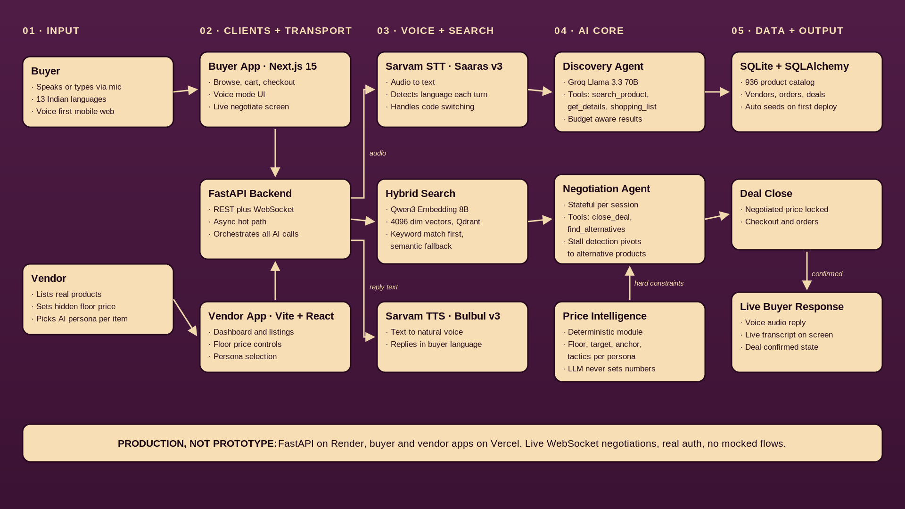

<div align="center">

# Jugaad

### Mol Karo, Save Karo — an AI-powered bazaar for how Bharat actually shops

Jugaad is a voice-first shopping app where buyers negotiate prices with an AI shopkeeper in 13 Indian languages, and vendors control the negotiation through a hidden floor price and a chosen AI persona. Built for Meesho's **Scripted By Her 2026** hackathon, theme: *Building Bharat with the Power of Agentic AI*.

[](https://jugaad-omega.vercel.app/)
[](#ai-integration)
[](#ai-integration)

</div>

---

## Live deployment

| Service | URL |
|---|---|
| Buyer app | https://jugaad-omega.vercel.app/ |
| Vendor app | https://jugaad-vendor.vercel.app/ |
| Backend API | https://jugaad-backend-qsa7.onrender.com |
| Demo video | **[ADD LINK BEFORE SUBMISSION]** |
| Source code | https://github.com/bhoomigundecha/Jugaad |

**Demo credentials (buyer):** `bhoomigundecha@gmail.com` / `bhoomi123`
Signup also works — both buyer and vendor accounts are real, not mocked.

---

## The problem

E-commerce brought the bazaar online, but not the experience of shopping in one. The discovery, the deal, and the dialogue make Indian market shopping feel human — and all three are missing.

| Gap | In the bazaar | In e-commerce |
|---|---|---|
| Discovery | You describe it; the shopkeeper brings it out | Scroll through 200 results |
| Negotiation | You bargain; both sides agree on a price | Fixed price; wait for a sale |
| Access | Shopkeeper speaks your language | Text-heavy; 600M vernacular users left out |

Buyers on value-focused platforms are culturally primed to negotiate but get exactly one lever: Buy Now. Meanwhile sellers sit on aging inventory with no dynamic way to move it — hold firm and don't convert, or blanket-discount and burn margin.

## The solution

An AI negotiation layer between buyer and seller, modeled on both sides:

- **Buyers** speak or type in their own language (13 Indian languages, detected fresh every turn), discover real products from a 936-item catalog, and haggle live with an AI agent representing that seller.
- **Vendors** list products, set a **floor price** (a hard minimum, never shown to buyers), and pick the AI's negotiation persona per product: **Meethi Didi** (warm, concedes faster — moves slow stock), **Vyapari** (direct, business-like), or **Mol-Bhav Queen** (anchors high, holds firm — protects margin).
- If a negotiation stalls, the AI pivots and pitches real alternative products from the same seller instead of repeating itself.

---

## AI integration

### The agents

| Agent | File | What it does |
|---|---|---|
| Discovery Agent | `backend/agents/discovery_agent.py` | Voice/text product search and shopping-list management. Stateless per turn. Tools: `search_product`, `get_product_details`, `update_shopping_list`, `recommend_outfit` |
| Negotiation Agent | `backend/agents/negotiation_agent.py` | Live price negotiation over WebSocket. Stateful per session (round count, offer history, floor/target/anchor). Tools: `close_deal`, `find_alternatives`, `get_product_details` |
| Price Intelligence | `backend/agents/price_intelligence.py` | **Deterministic, not LLM.** Computes floor price, target price, opening anchor, and persona tactics before the conversation starts |
| Deal Closing Agent | `backend/agents/deal_closing_agent.py` | Detects `DEAL_CONFIRMED`, locks the negotiated price, writes the deal to the database |
| Learning Agent | `backend/agents/learning_agent.py` | Logs deal outcomes, tactics used, and margin saved for future persona analytics |

### The models

| Layer | Model / Service | Why this choice |
|---|---|---|
| Reasoning + tool calling | Llama 3.3 70B on **Groq** (`llama-3.3-70b-versatile`) | LPU inference speed — a haggle must feel like live conversation, not a lagging chatbot |
| Speech to text | **Sarvam Saaras v3** (auto language detection) | Built for Indian languages and Hinglish code-switching; detects the buyer's language every turn |
| Text to speech | **Sarvam Bulbul v3** | Natural Indian-language voice replies |
| Embeddings | **Qwen3-Embedding-8B** (4096-dim) via Nebius | Spoken queries don't match catalog text — "something for a wedding" must match "Ethnic Wear: Sherwani" |
| Vector search | **Qdrant Cloud** | Hybrid retrieval: strict keyword+vector match first, pure semantic fallback |

### The guardrail that makes it trustworthy

The LLM handles the conversation; deterministic code handles the numbers. Price Intelligence computes the floor (hard minimum), target, opening anchor, and tactic set per persona **before any LLM call**. The agent cannot close below the floor no matter what the buyer says — it is enforced server-side as a constraint, not a prompt suggestion.

### Stall detection

The session tracker watches negotiation rounds and buyer offer movement. When a session looks stuck, it injects an internal nudge that pushes the agent to call `find_alternatives` — surfacing similar products from the same seller — instead of repeating the same counter-offer.

---

## Architecture



**Request flow (negotiation):** buyer speaks → `MediaRecorder` streams base64 audio over WebSocket (`routers/ws.py`) → Sarvam STT transcribes + detects language → Negotiation Agent (Groq) reasons within Price Intelligence constraints → reply text → Sarvam TTS → audio + live transcript stream back to the buyer.

Three independently deployed services: FastAPI backend on Render (persistent disk, always-on), Next.js buyer app and Vite vendor app on Vercel. Both frontends share one backend and one database — a vendor listing appears on the buyer side in the same request cycle, no sync step.

## Repository structure

```
jugaad/
├── backend/                  # FastAPI + Python
│   ├── main.py               # App entry, CORS, auto-seed on empty DB
│   ├── database.py           # SQLAlchemy models
│   ├── seed.py               # Seeds the 936-product catalog
│   ├── agents/               # 5 agents (see AI integration above)
│   ├── tools/                # Tool implementations for the agents
│   ├── routers/              # auth.py · buyer.py · vendor.py · ws.py
│   ├── voice/                # stt.py · tts.py · language_detect.py
│   ├── scripts/              # ingest_qdrant.py · classify_products.py
│   └── data/                 # Scraped + normalized catalog JSON
├── frontend/                 # Buyer app — Next.js 16, App Router
│   ├── app/                  # home · product/[id] · negotiate/[sessionId] · checkout
│   ├── components/           # AIOrb, LiveTranscript, ProductCard, ...
│   └── lib/                  # API client, auth/session
└── vendor/                   # Vendor app — Vite + React + Tailwind 4
```

---

## Running locally

### Prerequisites

- Python 3.11+ and Node.js 20+
- API keys (all have free tiers): [Groq](https://console.groq.com), [Sarvam AI](https://www.sarvam.ai/), [Nebius AI Studio](https://studio.nebius.ai/), [Qdrant Cloud](https://cloud.qdrant.io/)

### 1. Backend

```bash
cd backend
python -m venv venv && source venv/bin/activate   # Windows: venv\Scripts\activate
pip install -r requirements.txt
cp .env.example .env                               # fill in your keys
uvicorn main:app --reload                          # http://localhost:8000
```

`backend/.env`:

```env
GROQ_API_KEY=...
SARVAM_API_KEY=...
NEBIUS_API_KEY=...
QDRANT_ENDPOINT_URI=https://<cluster>.cloud.qdrant.io
QDRANT_API_KEY=...
DATABASE_URL=sqlite:///./jugaad.db
FRONTEND_URL=http://localhost:3000
ALLOWED_ORIGINS=http://localhost:3000,http://localhost:5173
```

The database auto-seeds all 936 products on first boot if empty (also runnable manually: `python seed.py`). To build the vector search index once: `python scripts/ingest_qdrant.py`.

### 2. Buyer app

```bash
cd frontend
npm install
npm run dev                                        # http://localhost:3000
```

`frontend/.env.local` (optional — defaults to localhost:8000):

```env
NEXT_PUBLIC_API_URL=http://localhost:8000
NEXT_PUBLIC_WS_URL=ws://localhost:8000
```

### 3. Vendor app

```bash
cd vendor
npm install
npm run dev                                        # http://localhost:5173
```

`vendor/.env` (optional — defaults to localhost:8000 / localhost:3000):

```env
VITE_API_URL=http://localhost:8000
VITE_FRONTEND_URL=http://localhost:3000
```

### Verify the build (what to test)

1. **Catalog**: open the buyer app — 936 real products with images and prices load from the backend.
2. **Voice discovery**: tap voice mode, say *"mujhe do hazar rupaye ke andar sneakers dikhao"* — real results within budget come back.
3. **Negotiation**: open a negotiable product, tap Negotiate, haggle. Try pushing below the floor price — the agent will not close there.
4. **Language switching**: reply in English mid-negotiation — the agent switches languages turn by turn.
5. **Two-sided sync**: sign up as a new vendor, list a product with a floor price and persona — it appears on the buyer app immediately.
6. **Stall recovery**: hold a lowball offer for several rounds — the agent pivots and offers alternative products from the same seller.

---

## Open source attribution

### Backend (Python)

| Library | Version | License | Role | Source |
|---|---|---|---|---|
| FastAPI | 0.115.0 | MIT | REST + WebSocket server | https://github.com/fastapi/fastapi |
| Uvicorn | 0.30.6 | BSD-3-Clause | ASGI server | https://github.com/encode/uvicorn |
| SQLAlchemy | 2.0.35 | MIT | ORM / database layer | https://github.com/sqlalchemy/sqlalchemy |
| Pydantic | 2.9.2 | MIT | Request/response validation | https://github.com/pydantic/pydantic |
| groq | 0.11.0 | Apache-2.0 | Groq LLM API client | https://github.com/groq/groq-python |
| openai | 1.54.4 | Apache-2.0 | OpenAI-compatible client used for Nebius embeddings | https://github.com/openai/openai-python |
| qdrant-client | 1.12.1 | Apache-2.0 | Vector search client | https://github.com/qdrant/qdrant-client |
| httpx | 0.27.2 | BSD-3-Clause | Async HTTP calls to Sarvam | https://github.com/encode/httpx |
| websockets | 13.1 | BSD-3-Clause | WebSocket support | https://github.com/python-websockets/websockets |
| python-dotenv | 1.0.1 | BSD-3-Clause | Env configuration | https://github.com/theskumar/python-dotenv |
| python-multipart | 0.0.12 | Apache-2.0 | Multipart form parsing | https://github.com/Kludex/python-multipart |
| aiofiles | 24.1.0 | Apache-2.0 | Async file I/O | https://github.com/Tinche/aiofiles |
| pandas | 2.2.3 | BSD-3-Clause | Catalog data normalization | https://github.com/pandas-dev/pandas |
| PyArrow | 18.1.0 | Apache-2.0 | Dataset processing | https://github.com/apache/arrow |
| Pillow | 11.0.0 | MIT-CMU | Image processing for catalog | https://github.com/python-pillow/Pillow |

### Buyer app (Next.js)

| Library | Version | License | Role | Source |
|---|---|---|---|---|
| Next.js | 16.2.9 | MIT | React framework, App Router | https://github.com/vercel/next.js |
| React / React DOM | 19.2.4 | MIT | UI runtime | https://github.com/facebook/react |
| Tailwind CSS | 4.x | MIT | Styling | https://github.com/tailwindlabs/tailwindcss |
| Framer Motion | 12.42.0 | MIT | Animations (AI orb, transitions) | https://github.com/motiondivision/motion |
| lucide-react | 1.21.0 | ISC | Icons | https://github.com/lucide-icons/lucide |
| @radix-ui/react-slot | 1.3.0 | MIT | Component composition | https://github.com/radix-ui/primitives |
| clsx | 2.1.1 | MIT | Conditional classnames | https://github.com/lukeed/clsx |
| class-variance-authority | 0.7.1 | Apache-2.0 | Component variants | https://github.com/joe-bell/cva |
| ESLint | 9.x | MIT | Linting | https://github.com/eslint/eslint |

### Vendor app (Vite)

| Library | Version | License | Role | Source |
|---|---|---|---|---|
| Vite | 8.1.1 | MIT | Build tool / dev server | https://github.com/vitejs/vite |
| React / React DOM | 19.2.7 | MIT | UI runtime | https://github.com/facebook/react |
| Tailwind CSS | 4.3.2 | MIT | Styling | https://github.com/tailwindlabs/tailwindcss |
| tailwind-merge | 3.6.0 | MIT | Class merging | https://github.com/dcastil/tailwind-merge |
| Framer Motion | 12.42.2 | MIT | Animations | https://github.com/motiondivision/motion |
| lucide-react | 1.24.0 | ISC | Icons | https://github.com/lucide-icons/lucide |
| oxlint | 1.71.0 | MIT | Linting | https://github.com/oxc-project/oxc |
| PostCSS / Autoprefixer | 8.5.19 / 10.5.2 | MIT | CSS processing | https://github.com/postcss/postcss |

### External services (hosted APIs, not open source)

| Service | Role |
|---|---|
| Groq | Llama 3.3 70B inference (LPU) |
| Sarvam AI | Saaras v3 STT, Bulbul v3 TTS |
| Nebius AI Studio | Qwen3-Embedding-8B embeddings |
| Qdrant Cloud | Managed vector database |
| Render / Vercel | Hosting (backend / both frontends) |

### Data sources

Catalog of 936 products normalized from a Tata CLiQ scrape (`backend/scraper_tatacliq.py`, built with Playwright + BeautifulSoup, run offline) and a HuggingFace fashion-image dataset **[ADD EXACT DATASET LINK]**. Product data is used for hackathon demonstration purposes only.

---

## Known limitations and roadmap

- Language-detection edge cases for voice input and search-relevance tuning are in active refinement.
- Roadmap: per-category negotiation personas, vendor-side persona analytics ("this listing has sat unsold 30 days — switch it to Meethi Didi"), group mol-bhav (bring-a-friend bulk bargaining), and a buyer-visible fairness layer showing the AI negotiates in good faith.

---

<div align="center">

### Built by Bhoomi Gundecha for Meesho Scripted By Her 2026

**Mol Karo, Save Karo**

</div>
